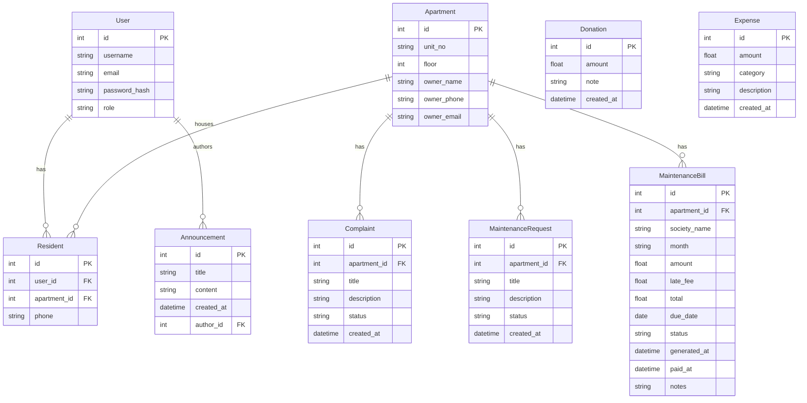
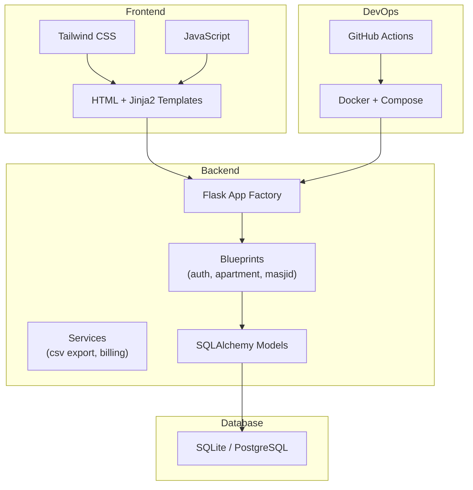
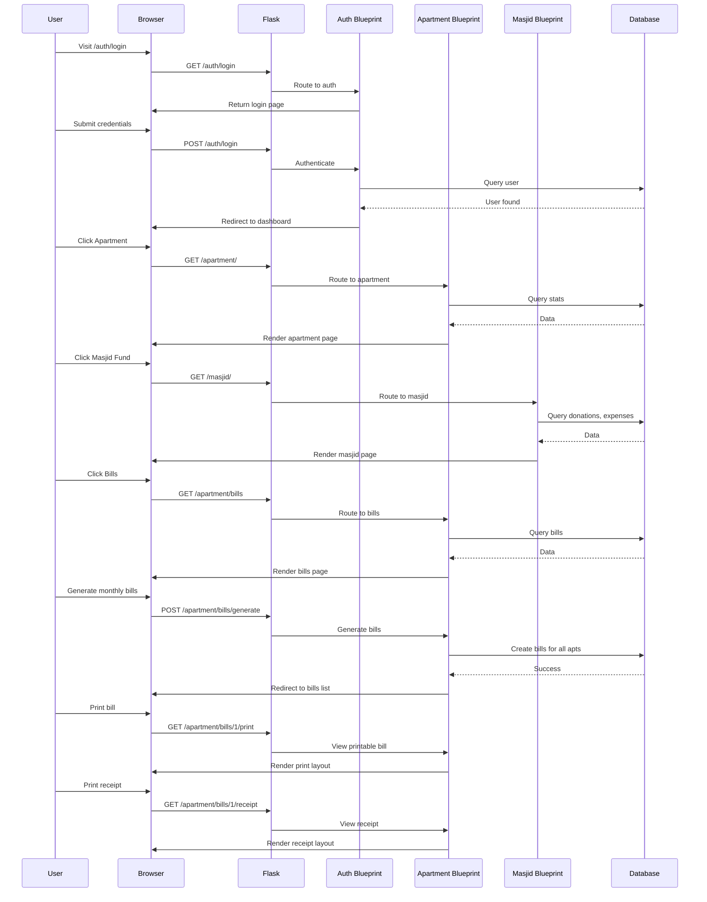
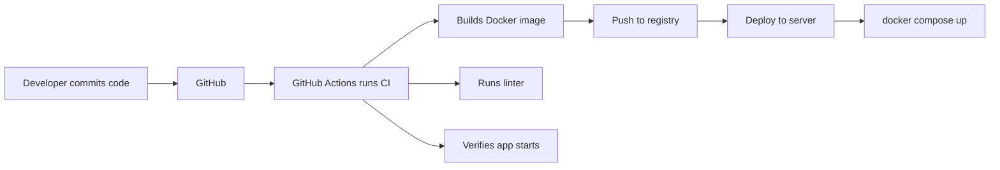

# Graphify — Diagrams

## ER Diagram

```mermaid
erDiagram
    User {
        int id PK
        string username
        string email
        string password_hash
        string role
    }

    Apartment {
        int id PK
        string unit_no
        int floor
        string owner_name
        string owner_phone
        string owner_email
    }

    Resident {
        int id PK
        int user_id FK
        int apartment_id FK
        string phone
    }

    Complaint {
        int id PK
        int apartment_id FK
        string title
        string description
        string status
        datetime created_at
    }

    MaintenanceRequest {
        int id PK
        int apartment_id FK
        string title
        string description
        string status
        datetime created_at
    }

    Announcement {
        int id PK
        string title
        string content
        datetime created_at
        int author_id FK
    }

    MaintenanceBill {
        int id PK
        int apartment_id FK
        string society_name
        string month
        float amount
        float late_fee
        float total
        date due_date
        string status
        datetime generated_at
        datetime paid_at
        string notes
    }

    Donation {
        int id PK
        float amount
        string note
        datetime created_at
    }

    Expense {
        int id PK
        float amount
        string category
        string description
        datetime created_at
    }

    User ||--o{ Resident : "has"
    User ||--o{ Announcement : "authors"
    Apartment ||--o{ Resident : "houses"
    Apartment ||--o{ Complaint : "has"
    Apartment ||--o{ MaintenanceRequest : "has"
    Apartment ||--o{ MaintenanceBill : "has"
```

## System Architecture

```mermaid
graph TD
    subgraph "Frontend"
        HTML["HTML + Jinja2 Templates"]
        CSS["Tailwind CSS"]
        JS["JavaScript"]
    end

    subgraph "Backend"
        Flask["Flask App Factory"]
        Blueprints["Blueprints<br/>(auth, apartment, masjid)"]
        Services["Services<br/>(csv export, billing)"]
        Models["SQLAlchemy Models"]
    end

    subgraph "Database"
        SQLite["SQLite / PostgreSQL"]
    end

    subgraph "DevOps"
        Docker["Docker + Compose"]
        CI["GitHub Actions"]
    end

    HTML --> Flask
    CSS --> HTML
    JS --> HTML
    Flask --> Blueprints
    Blueprints --> Models
    Models --> SQLite
    Docker --> Flask
    CI --> Docker
```

## Request Flow

```mermaid
sequenceDiagram
    participant U as User
    participant B as Browser
    participant F as Flask
    participant A as Auth Blueprint
    participant AP as Apartment Blueprint
    participant M as Masjid Blueprint
    participant DB as Database

    U->>B: Visit /auth/login
    B->>F: GET /auth/login
    F->>A: Route to auth
    A->>B: Return login page

    U->>B: Submit credentials
    B->>F: POST /auth/login
    F->>A: Authenticate
    A->>DB: Query user
    DB-->>A: User found
    A->>B: Redirect to dashboard

    U->>B: Click Apartment
    B->>F: GET /apartment/
    F->>AP: Route to apartment
    AP->>DB: Query stats
    DB-->>AP: Data
    AP->>B: Render apartment page

    U->>B: Click Masjid Fund
    B->>F: GET /masjid/
    F->>M: Route to masjid
    M->>DB: Query donations, expenses
    DB-->>M: Data
    M->>B: Render masjid page

    U->>B: Click Bills
    B->>F: GET /apartment/bills
    F->>AP: Route to bills
    AP->>DB: Query bills
    DB-->>AP: Data
    AP->>B: Render bills page

    U->>B: Generate monthly bills
    B->>F: POST /apartment/bills/generate
    F->>AP: Generate bills
    AP->>DB: Create bills for all apts
    DB-->>AP: Success
    AP->>B: Redirect to bills list

    U->>B: Print bill
    B->>F: GET /apartment/bills/1/print
    F->>AP: View printable bill
    AP->>B: Render print layout

    U->>B: Print receipt
    B->>F: GET /apartment/bills/1/receipt
    F->>AP: View receipt
    AP->>B: Render receipt layout
```

## Deployment Flow

```mermaid
graph LR
    Dev["Developer commits code"] --> GitHub
    GitHub --> CI["GitHub Actions runs CI"]
    CI --> Build["Builds Docker image"]
    CI --> Lint["Runs linter"]
    CI --> Test["Verifies app starts"]
    Build --> Push["Push to registry"]
    Push --> Deploy["Deploy to server"]
    Deploy --> Running["docker compose up"]
```
